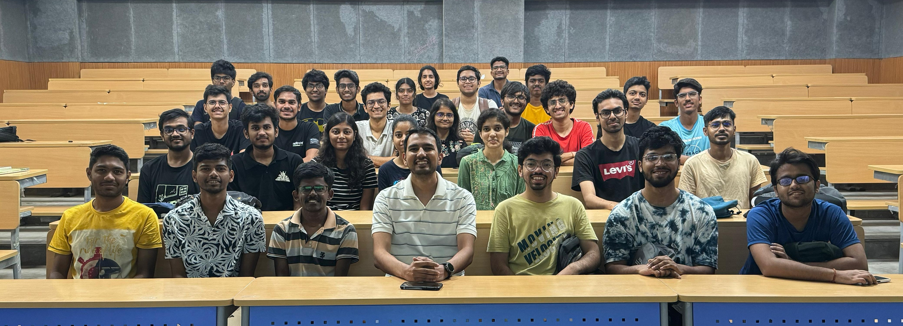

<!--  -->
Foundations of Artificial Intelligence is an entry-level course that invites students to explore the science — and the wonder — behind intelligent systems, both natural and artificial.
Through a blend of lectures, discussions, and interactive activities, students will examine what it means to be “intelligent” from the perspectives of psychology, neuroscience, philosophy, and computer science. Topics include the history and milestones of AI, biological and artificial models of intelligence, sensory perception, learning mechanisms, and the ethical and societal implications of intelligent systems.

Designed for curious minds in their very first semester, the course balances theory with creative engagement: from paper-reading sessions and student presentations to puzzles, games, and thought experiments. By the end, students will have both a conceptual foundation and the critical thinking skills to understand current AI systems, their limitations, and the big questions that still remain.

## Syllabus
Definitions and perspectives on intelligence; Biological vs. artificial intelligence; History of modeling intelligence; McCulloch & Pitts neuron model; Neural signaling and basic brain structures; Visual and auditory systems in humans and animals; Sensory processing and pattern recognition; Case studies in animal intelligence (tool use, navigation, communication); Symbolic vs. connectionist approaches to AI; Intelligence and learning mechanisms; Introduction to embodied cognition; Measuring intelligence: IQ, psychometrics, and the Turing Test; Comparing human and machine intelligence; Historical milestones in AI development; Interdisciplinary perspectives (psychology, neuroscience, philosophy, computer science); Ethics and social implications of intelligent systems; Current limitations of AI and open questions; Future directions: AGI, brain-computer interfaces, and intelligence augmentation.

## Pre-requisites
This is a first-year introductory course — no prior background in artificial intelligence is required.
However, curiosity, an open mind, and a willingness to engage with ideas from multiple disciplines are essential.
Basic comfort with high-school level mathematics (algebra, functions, basic probability) will be helpful, and students should be ready to participate actively in discussions, problem-solving activities, and creative exercises.

## Logistics

**Core Course**: For First Semester B.Tech in Data Science and AI students

**Class Room**: 5303, Core-5

**Timings**: 11:00 am, Mon and 8:00 am, Wed

Please visit this page regularly for updated information on the course. 
